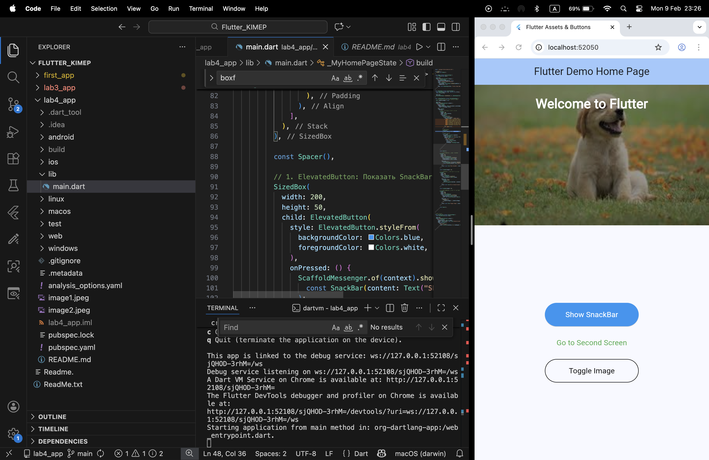

# Lab 4: Flutter Assets, Layouts, and Navigation

This project was developed as part of **Lab 4** to demonstrate proficiency in handling local assets, creating layered layouts with the `Stack` widget, and implementing multi-screen navigation in Flutter.

## Features
* **Lab 4 Task - Asset Integration**: Successfully integrated local `.jpeg` images into the application lifecycle.
* **Stack Layout**: Built a sophisticated UI using the `Stack` widget, including:
    * A background image using `BoxFit.fill`.
    * A semi-transparent black overlay for visual depth.
    * A top-aligned title using `Align` and `Padding`.
* **State Management**: Used an `OutlinedButton` to dynamically toggle between different images in the assets folder.
* **Navigation**: Configured a `TextButton` to navigate to a clean, secondary "Second Screen."
* **Notifications**: Integrated an `ElevatedButton` that triggers a `SnackBar` to provide user feedback.

## Visual Result
The following screenshot represents the final output of Lab 4:

## BoxFit Experimentation
The code contains detailed comments explaining the scaling effects of the `Image` widget:
* **fill**: Stretches the image to fit the container precisely.
* **cover**: Fills the container by cropping the image to maintain its aspect ratio.
* **contain**: Fits the entire image within the container without cropping.

## Setup Instructions
1. Clone the repository.
2. Ensure the images `image1.jpeg` and `image2.jpeg` are in the project root.
3. Run `flutter pub get` to sync dependencies and assets.
4. Execute `flutter run`.